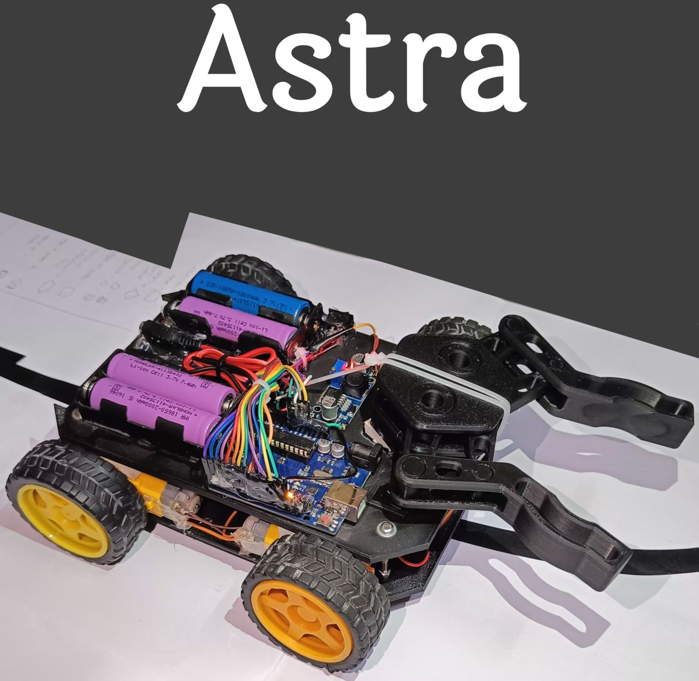

# ASTRA – Smart Warehouse Automation 🤖📦

ASTRA (**Automated Smart Tracking & Robotics for Warehousing**) is a smart robotic system that automates product sorting and placement in warehouses using QR code scanning, Bluetooth communication, and autonomous line-following navigation. This project aims to minimize human effort, improve accuracy, and enhance operational efficiency.

---

## 🔧 Tech Stack & Tools Used

- **Flutter & Dart** – Cross-platform mobile app for QR scanning and Bluetooth communication
- **Arduino IDE** – Programming platform for the microcontroller (Arduino Uno)
- **Python + OpenCV** – For QR code generation
- **SolidWorks** – For 3D designing the robot chassis and mechanical parts
- **GitHub** – For version control and project collaboration

---

## 🔩 Components Used

- **Arduino Uno** – Microcontroller brain of the robot
- **HC-05 Bluetooth Module** – Wireless communication with the mobile app
- **5-Way IR Sensor Array** – For black line detection and path following
- **L293D Motor Driver Module** – Controls the movement of 4 DC motors
- **4 × DC Geared Motors with Wheels** – For movement and navigation
- **MG996R Servo Motor** – For gripping and releasing the box
- **Battery Pack (Li-ion / Lead-Acid)** – Power supply for the entire system
- **Chassis Frame** – To mount components
- **Black Electrical Tape (2.5 cm width)** – For path creation
- **White Surface (Floor/Base)** – Essential for IR sensor accuracy
- **Smartphone** – For QR scanning and controlling the robot

---

## 📲 How It Works

1. The user scans a QR code using the Flutter-based mobile app.
2. The app extracts the **product delivery details** (like city and pincode).
3. This data is sent to the robot over **Bluetooth (via HC-05)**.
4. Upon receiving the data:
   - The robot activates the **servo gripper** to **pick up the box**.
   - It then starts following the **black line path** using the IR sensor array.
   - At junctions, the robot makes decisions based on the product's destination.
   - The product is placed in its **designated warehouse zone** using the servo mechanism.

---

## 📸 Project Visuals

### 🔌 Circuit Diagram

### 🤖 Robot Photo

---

## ⚠️ Important Setup Notes

- Use **black electrical tape (2.5 cm wide)** on a **white surface**. Other surfaces may interfere with IR accuracy.
- Follow the **circuit diagram exactly** to ensure correct hardware setup.
- Connect the **HC-05 Bluetooth module** to the correct TX/RX pins and pair it using your system’s Bluetooth settings. Select the **correct COM port** in your app.
- **Do not overcharge the batteries** — use a reliable charging circuit and battery protection board.
- To generate your own QR codes, download the QR system from my separate repository:
  🔗 [QR Code Generator Repo](https://github.com/pritam-t/QR-System) 

---

## 📦 Features

- Real-time product identification using QR codes
- Bluetooth-based wireless control and data transmission
- Autonomous line-following and smart junction decisions
- Servo-based gripping and placement system
- User-friendly mobile interface
- Modular and scalable for real-world warehouse use

---

## 📄 License

This is a personal academic project developed as part of my engineering curriculum.  
You are welcome to explore, modify, and build upon this project for **non-commercial** or **educational** use.

> ⚠️ Please do not use this project for commercial purposes without explicit permission.

---

## 💬 Thank You!

Thank you for checking out ASTRA!  
Feel free to explore the repository, try the project, and share your feedback or suggestions.

> _Let’s build smarter warehouses, one robot at a time._ 🚀

---